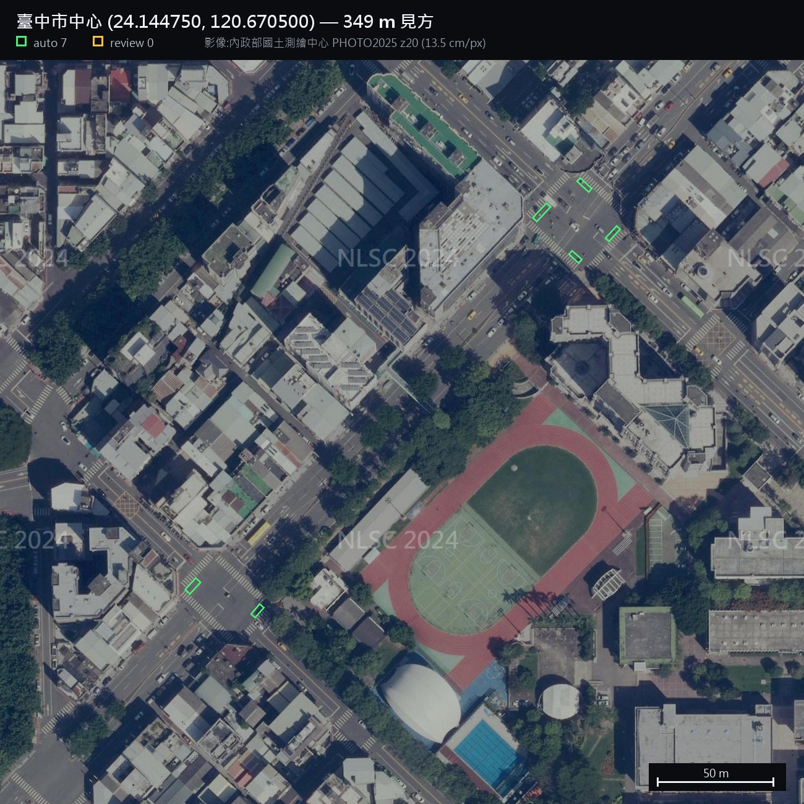
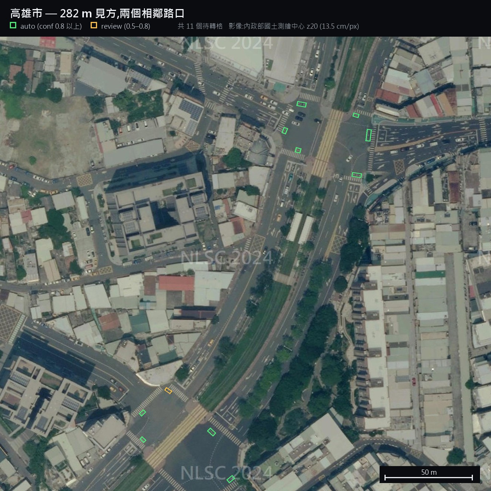

# dieturn

從正射影像辨識**機車待轉格**,產出全台待轉格圖資。

台灣有約 30,000 個號誌路口,其中哪些需要機車兩段式左轉、待轉格畫在哪一角,
目前沒有公開的完整資料。這個專案用航拍影像加物件偵測把它掃出來。

**目前成果:全台 29,925 個路口 → 18,243 個待轉格,分佈在 9,790 個路口(32.7%)。**

<table>
  <tr>
    <th>臺中</th>
    <th>高雄</th>
  </tr>
  <tr>
    <td width="50%"></td>
    <td width="50%"></td>
  </tr>
</table>

<sub>左:臺中,以 24.144750°N、120.670500°E 為中心,349 m 見方。右:高雄路口,282 m 見方。綠框 = `auto`(conf 0.8 以上),
黃框 = `review`(0.5–0.8,需人工複核)。待轉格位在路口角落、緊貼行人穿越道前方 ——
正是道交規則 §99「先直行至前方路口右側待轉區」的位置。
影像:內政部國土測繪中心 PHOTO2025 z20。</sub>

---

## 效果

同一個路口,舊模型(v0.5)與新模型(v0.6)的偵測結果。
黃圈 = 高解析影像確認存在的待轉格位置,紅框 = v0.5,綠框 = v0.6。


四個角都有待轉格的大路口,v0.5 各只找到 1 個角,v0.6 四個角全中。
這類路口的「全部找齊」比例從 **24% 提升到 71%**。


陰影、樹冠遮蔽、斜向路口 —— 六個案例中五個是 v0.5 完全沒有偵測。
台北 1,096 個參考位置中,**v0.6 多找回 234 個、只退步 13 個**。

詳細評估與**已知的失效模式**見 [`docs/MODEL.md`](docs/MODEL.md)。

---

## 你要的是哪一個

| 我想… | 去這裡 |
|---|---|
| **拿待轉格圖資來用** | [`geodata/output_taiwan/dieturn.geojson`](geodata/output_taiwan/dieturn.geojson) — GeoJSON,18,243 筆。欄位定義見 [`docs/PIPELINE.md`](docs/PIPELINE.md),**使用前必讀** [`DATA_LICENSES.md`](DATA_LICENSES.md) |
| **用模型跑自己的影像** | v0.5 權重在 [HuggingFace](https://huggingface.co/xamjiang/dieturn-yolo26s-obb);v0.6 尚未發布,用法見下方「模型」。**影像格式有嚴格限制** |
| **知道這東西準不準** | [`docs/MODEL.md`](docs/MODEL.md) — 完整評估、失效模式、限制 |
| **自己重跑整條管線** | 下方「管線」。全台抓圖約 8 小時、推論約 30 分鐘 |
| **擴充或重建訓練資料** | [`docs/ANNOTATION_GUIDE.md`](docs/ANNOTATION_GUIDE.md) |
| **理解資料可信度的設計** | [`docs/VERIFICATION_LEVELS.md`](docs/VERIFICATION_LEVELS.md) — 這是本專案的核心概念 |

---

## 模型

| | v0.5 | **v0.6** |
|---|--:|--:|
| 台北 recall(3 尺度,conf 0.50) | 0.576 | **0.807** |
| `heading` P95 誤差 | 14.9° | **7.1°** |
| 訓練資料 | 320 張(62% 高解析域) | **1,500 張(100% 同域)** |
| 標註框 | 211 | **1,415** |

v0.5 權重在 HuggingFace:[`xamjiang/dieturn-yolo26s-obb`](https://huggingface.co/xamjiang/dieturn-yolo26s-obb)(AGPL-3.0)。
**v0.6 權重尚未發布;以下範例需先取得本機 v0.6 權重。**

```python
from ultralytics import YOLO
m = YOLO("dieturn-yolo26s-obb-v0.6.pt")
r = m.predict("intersection.jpg", imgsz=1024, conf=0.5)
```

> **影像必須是 NLSC z20 正射影像(13.5 cm/px、768×768 的 3×3 瓦片拼接)。**
> 換來源、換解析度會大幅退化 —— 這是 v0.5 的主要問題,詳見
> [`docs/MODEL.md`](docs/MODEL.md) 第 3.3 節。

完整評估、已知失效模式與限制:**[`docs/MODEL.md`](docs/MODEL.md)**

---

## 管線

```
imagery/  抓圖 ──→ ml/  訓練+推論 ──→ geodata/  轉世界座標 ──→ export_app.py
(index.csv)        (detections.csv)   (dieturn.geojson)      (給前端的 GeoJSON)
```

```bash
python imagery/build_points.py                    # OSM 號誌節點 → 路口取樣點
python imagery/fetch_ortho.py --source nlsc_photo2025 \
       --points imagery/points_taiwan_z20.csv --out imagery/taiwan_z20
python ml/predict.py --source imagery/taiwan_z20/images \
       --index imagery/taiwan_z20/index.csv --out runs/tw --imgsz 1024 --no-plot
python geodata/build_geodata.py --detections runs/tw/detections.csv \
       --index imagery/taiwan_z20/index.csv --out geodata/output_taiwan
```

全台抓圖約 **8 小時**(60 張/分)、推論約 **10 分鐘/尺度**(RTX 3080)。
影像約 2.7 GB,不在 repo 裡,用上面的腳本重抓。

需求:Python 3.10+、`torch`、`ultralytics`、`shapely`、`Pillow`、`requests`。

---

## 文件

| | |
|---|---|
| [`docs/MODEL.md`](docs/MODEL.md) | **模型評估** — v0.5→v0.6、失效模式、訓練資料組成 |
| [`docs/METHODS.md`](docs/METHODS.md) | 推論方法 — 尺度、多尺度聯集、多年度影像 |
| [`docs/PIPELINE.md`](docs/PIPELINE.md) | 管線流程與 **GeoJSON 欄位定義** |
| [`docs/VERIFICATION_LEVELS.md`](docs/VERIFICATION_LEVELS.md) | **查證等級制度** — 每一筆資料「怎麼被確認的」 |
| [`docs/ANNOTATION_GUIDE.md`](docs/ANNOTATION_GUIDE.md) | 標註規範(要重建或擴充資料集時看這個) |

## 這份圖資能信到什麼程度

**不要當成權威資料使用。** 四個具體限制:

1. **絕對準確率未知。** 現有的評估用臺北 z21 影像當 ground truth,而那個
   ground truth 本身是舊模型的輸出、未經人工確認,**包含誤報**。
   v0.5 與 v0.6 的相對比較可信,絕對數字不可信。
2. **台北以外完全未量測。** 訓練資料涵蓋 21 個縣市,但沒有任何一個縣市
   有獨立的驗收資料。
3. **沒有實地驗證。** 所有結果都只是影像上的比對。
4. **評估數字無法獨立重現。** 當作 ground truth 的臺北 z21 影像與其衍生資料
   受來源條款限制,不隨此 repo 散布(見 [`DATA_LICENSES.md`](DATA_LICENSES.md))。
   全台掃描的部分則完全可重現。

[`docs/VERIFICATION_LEVELS.md`](docs/VERIFICATION_LEVELS.md) 提出一套查證等級制度
來處理這件事 —— 核心是:**「這裡要待轉」說錯只是多等一個燈,
「可以直接左轉」說錯是罰單**,兩種主張的證據門檻必須不同。

---

## 授權

程式碼為 **Apache-2.0**(見 [`LICENSE`](LICENSE))。散布時須一併附上
[`NOTICE`](NOTICE) —— 那是 Apache-2.0 第 4(d) 條的要求,裡面載明必須標示的來源。

**資料的授權與程式碼不同,而且混合了多種來源 ——
使用前請讀 [`DATA_LICENSES.md`](DATA_LICENSES.md)。**

> ⚠️ `ml/` 底下的程式碼 import `ultralytics`(AGPL-3.0)。Ultralytics 主張使用其
> 程式庫的程式碼亦受 AGPL 約束;此主張有爭議,本專案不提供法律意見。
> 商業使用請自行評估。

摘要:圖資為 **ODbL 1.0**,影像來自**內政部國土測繪中心**(使用須註明出處),
路口資料 **© OpenStreetMap contributors**,模型權重為 **AGPL-3.0**。

---

## 相關專案

[HowTurn](https://github.com/PlanktonLab/HowTurn) — 使用這份圖資的機車導航 App。
