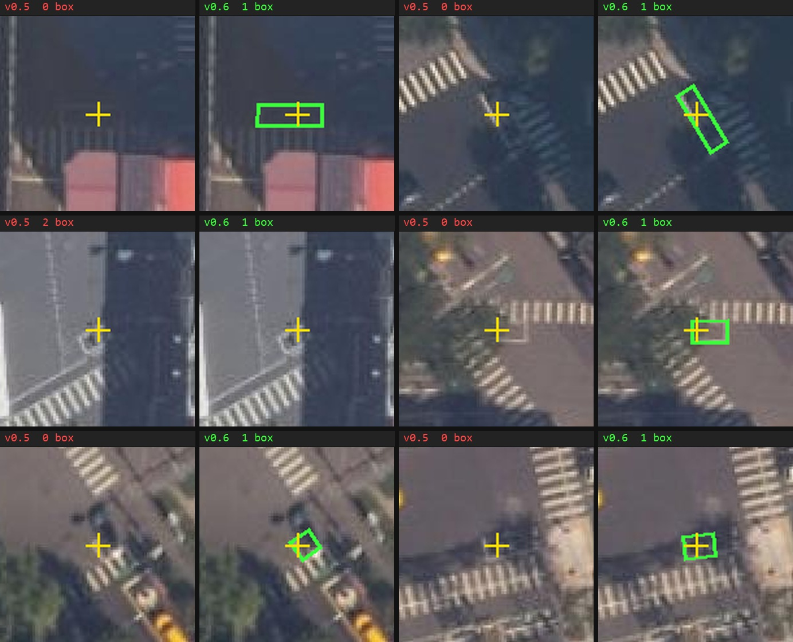
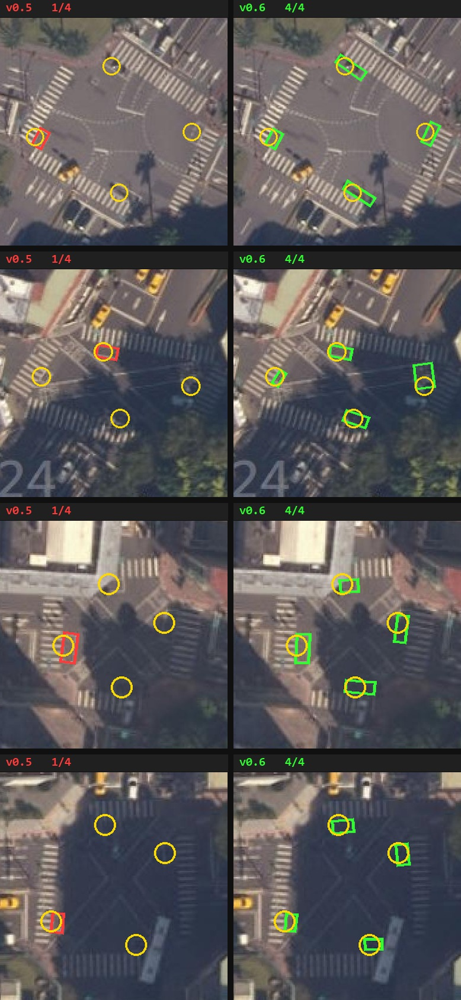
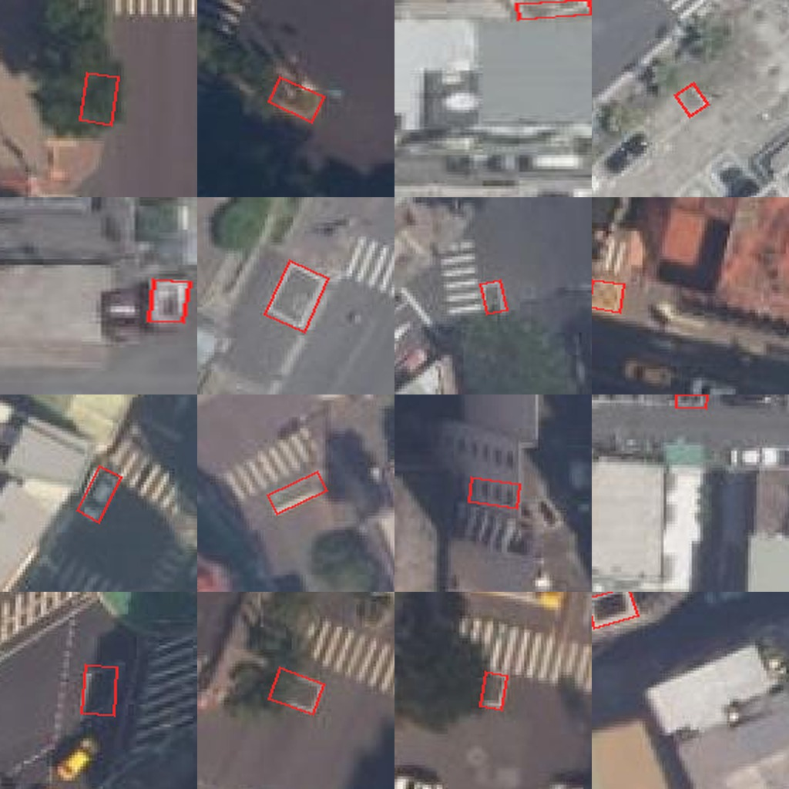
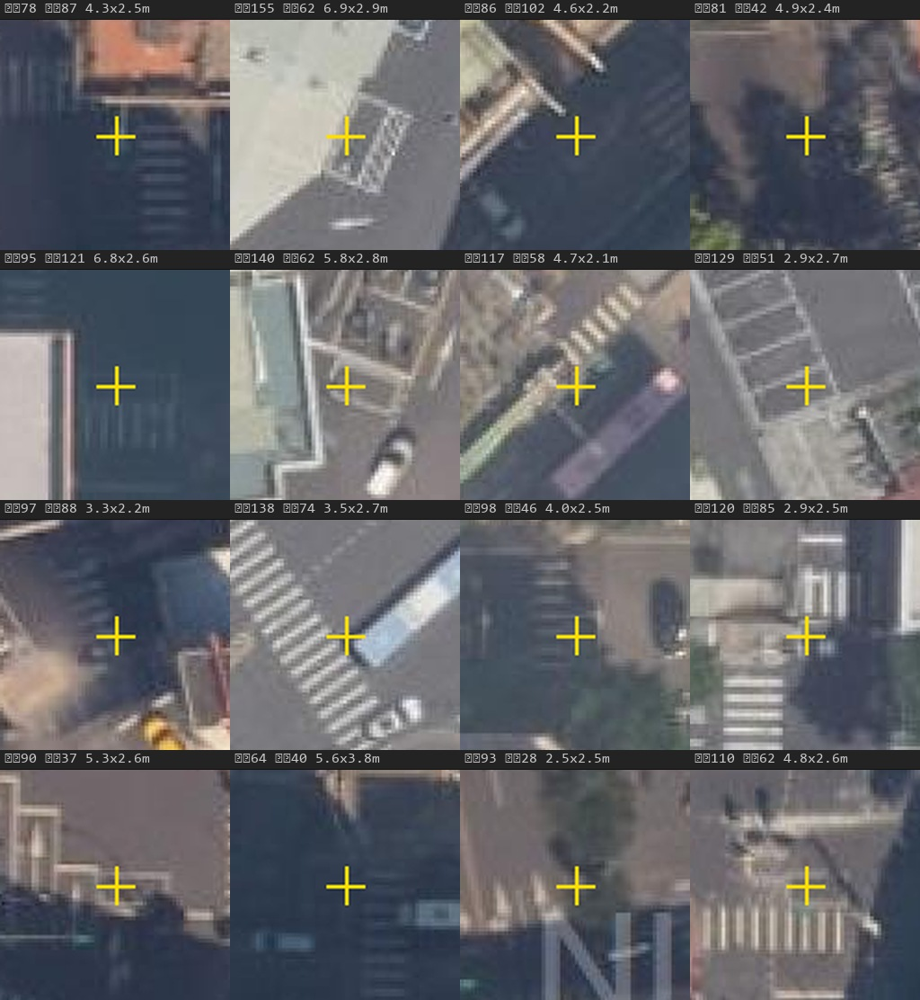

# 模型評估 — v0.5 → v0.6

從 v0.5 到 v0.6 的改動只有一件事:**訓練資料換成 1,500 張人工標註的 NLSC z20 影像**。
模型架構、超參數、推論流程都沒動。

| | v0.5 | **v0.6** |
|---|---|---|
| 訓練影像 | 320 張(**62% 是 z21 7 cm/px**) | **1,500 張(100% z20 13.5 cm/px)** |
| 標註框 | 211 | **1,415** |
| 涵蓋範圍 | 台北市 | **21 個縣市**(最大占比 6.6%) |
| train / val | 256 / 64 | 1,200 / 300 |
| 訓練 | 144 epoch(MPS) | 228/300 epoch(RTX 3080, patience 60) |
| 基礎權重 | YOLO26s-OBB (DOTAv1) | **從 v0.5 續訓** |

---

## 1. 評估方法

> **本節的參考資料不隨 repo 散布。** ground truth 來自臺北市都發局的 z21 影像,
> 其使用條款禁止批次取圖與轉供第三方流通,因此影像、取樣點、瓦片座標與衍生圖資
> 全部排除在公開版本之外(見 [`../DATA_LICENSES.md`](../DATA_LICENSES.md))。
> **本節數字無法用本 repo 獨立重現**,保留下來是為了透明呈現評估方法與限制。
> 第 2.5 節的全台結果不受影響,完全可重現。

對照區:**臺北市 2,466 個路口**(臺北市 2,436 + 邊界新北 30,用「離任一台北取樣點
500 m 內」篩選,避免 40 m 聚合把邊界路口歸給鄰縣而低估 recall)。

ground truth:臺北市 z21 影像(都發局 6.8 cm/px)上偵測到的 1,099 個 `auto` 框
(conf ≥ 0.8),其中 1,096 個落在 z20 掃描範圍內。命中判準為中心距 ≤ 3 m。

> ### ⚠️ 這個 ground truth 有已知缺陷,看結論前必須知道
>
> **它不是人工標註,是 v0.5 自己跑在 z21 影像上的輸出。** 所以它包含 v0.5 在
> 高解析影像上的誤報 —— 而「形狀相近的白色矩形」正是 v0.5 model card 記載的
> 第一名誤判來源。目視抽查證實有相當比例的「真值」落在建物屋頂、車輛上。
>
> 量化佐證:兩個模型都「漏掉」的 187 個之中,**尺寸異常率 43.3%**、
> **離路口超過 35 m 的比例 5.3%**;而 v0.6 命中的 896 個對應數字是 33.7% 與 1.7%。
>
> **影響:** 絕對 recall 被低估(分母含假真值),而且 precision 也被低估
> (部分「多餘框」其實是 z21 漏掉、v0.6 找到的真框)。
> **但 v0.5 與 v0.6 的相對比較仍然成立**,因為兩者用同一個分母。
>
> 要取得可信的絕對數字,需要各縣市分層隨機的人工量測集。**尚未建立。**

---

## 2. 結果

### 2.1 台北 recall

| 推論策略 | v0.5 | **v0.6** |
|---|--:|--:|
| 單尺度 768 | 0.616 | **0.818** |
| 3 尺度聯集(768/1024/1280) | 0.657 | **0.850** |
| 3 年度 × 3 尺度 | 0.823 | — |

正式管線門檻(`conf = 0.50`,`build_geodata.py` 的 `REVIEW_CONF`):

| | v0.5 | **v0.6** |
|---|---|---|
| 單尺度 | 0.517 / 多餘框 209 | **0.751 / 278** |
| 3 尺度 | 0.576 / 244 | **0.807 / 383** |

### 2.2 是準度提升,不是多吐框

框數增加會讓 recall 上升,所以要倒過來問:**達到同樣的 recall,各需要吐多少多餘框?**

**單尺度 768**

| recall | v0.5 | v0.6(600 張中途版) | **v0.6(1500 張)** |
|--:|--:|--:|--:|
| 0.60 | 433 | 173 | **155** |
| 0.70 | 達不到 | 277 | **211** |
| 0.75 | 達不到 | 423 | **276** |
| 0.80 | 達不到 | 738 | **404** |

**3 尺度聯集**

| recall | v0.5 | v0.6(600 張) | **v0.6(1500 張)** |
|--:|--:|--:|--:|
| 0.70 | 達不到 | 242 | **198** |
| 0.75 | 達不到 | 363 | **243** |
| 0.80 | 達不到 | 562 | **357** |
| 0.85 | 達不到 | 1793 | **816** |

每一個點都更好,而且差距在高 recall 區拉大。v0.5 把門檻降到 0.15 也只到 0.616。

### 2.3 逐一比對

台北 1,096 個 ground truth,兩個模型的交叉結果:

| | 數量 | |
|---|--:|---|
| 兩者都找到 | 662 | 60.4% |
| **只有 v0.6 找到** | **234** | **21.4%** |
| 只有 v0.5 找到 | 13 | 1.2% |
| 兩者都漏 | 187 | 17.1% |

**救回 234、退步 13,比例 18:1。** 淨增加 221 個(+20.2%)。



*黃十字 = ground truth 位置,紅框 = v0.5,綠框 = v0.6。六個案例中五個是 v0.5 完全無偵測。*

#### 大路口的完整度

四個角都有待轉格的大路口,改善最明顯:

| GT 框數 | 路口數 | v0.5 全部找到 | **v0.6 全部找到** |
|--:|--:|--:|--:|
| 1 | 322 | 55% | **75%** |
| 2 | 206 | 38% | **67%** |
| 3 | 52 | 44% | **65%** |
| **4** | 49 | **24%** | **71%** |



*四個 GT 有 4 個待轉格的路口。黃圈 = ground truth 位置,紅框 = v0.5 偵測,
綠框 = v0.6 偵測。v0.5 各只找到 1 個角,v0.6 四個角全中。*

> 這是單框準確度提升的複合效果,不是模型學會了「四個角應該對稱」——
> YOLO 對每個框獨立輸出,沒有結構化推論。四框路口的單框偵測率從 0.69 升到 0.91,
> 而 0.69⁴ = 0.23、0.91⁴ = 0.70,與實測的 24% → 71% 相符。

### 2.4 角度精度

| | `heading_deg` P95 誤差 |
|---|--:|
| v0.5 | 14.9° |
| v0.6(600 張) | 10.4° |
| **v0.6(1500 張)** | **7.1°** |

這個直接影響 `serves_from_bearing` —— 也就是下游判斷「從某方向進來該靠左或靠右」的依據。

### 2.5 全台圖資

以 3 尺度聯集對全台 29,925 個路口重跑:

| | v0.5 | **v0.6** | |
|---|--:|--:|---|
| 待轉格總數 | 9,735 | **18,243** | **+87%** |
| 有待轉格的路口 | 6,000 (20.1%) | **9,790 (32.7%)** | +63% |
| `auto`(conf ≥ 0.8) | 6,839 | **15,605** | +128% |
| `review`(0.5–0.8) | 2,896 | **2,638** | **−9%** |

**`auto` 增加 128% 而 `review` 反而減少** —— 新找到的框集中在高信心區,
人工複核的負擔沒有變重。信心中位數從 0.764 升到 0.894。

對照:臺北市用 z21 高解析影像實測有待轉格的路口比例是 **29.6%**,
v0.6 在全台 z20 上得到 32.7%,兩者已經相當接近。

---

## 3. 已知失效模式

### 3.1 建物屋頂的白色矩形(主要誤報來源)

目視抽查 v0.6 在台北 conf ≥ 0.5 且未命中 ground truth 的 484 個框,隨機 16 個中約
5 個明確落在**建物屋頂、立面窗格、車輛**上。



這是新發現的類型。標註規範裡雖然定義了 `other_box` 類別,但**兩輪標註都沒有實際使用**
(見 [`ANNOTATION_GUIDE.md`](ANNOTATION_GUIDE.md)),而且它針對的是**地面**上的白色矩形
(機車停等區、停車格、公車停靠區),本來就沒有涵蓋屋頂。

**可能的解法**(皆未實作):

1. 補屋頂負樣本進下一輪標註
2. **幾何過濾** —— 待轉格必須在路面上。用 OSM 道路幾何做遮罩,一次濾掉整類誤報,
   不需重訓。成本遠低於前者

但要注意:同一批抽查中約半數的「多餘框」尺寸正常(中位 4.58 × 2.61 m,
台北基準是 4.85 × 2.53 m),**看起來是 ground truth 自己漏掉的真待轉格**。
所以誤報率比表面數字低。

### 3.2 仍有 17.1% 漏檢



那 187 個混了兩種東西:真的漏檢(陰影、樹冠、車輛遮擋)與假的真值(見第 1 節)。
無法只靠現有資料分開。

### 3.3 域限制

**只在 NLSC z20 正射影像(13.5 cm/px、768 px 拼接圖)上驗證過。** 換影像來源、
換解析度、換拍攝角度都可能大幅退化 —— 這正是 v0.5 的主要問題(62% 訓練資料是
z21 7 cm/px,在 z20 上 recall 只有 0.616)。

---

## 4. 推論設定

### 4.1 尺度:不要事後放大

實測 v0.5 在不同 `imgsz` 的 recall(同一批影像、同一個模型):

| `imgsz` | 物件像素 | 相對訓練尺度 | Recall |
|--:|--:|--:|--:|
| 768(native) | 36×19 | ×1.00 | **0.615** |
| 1024 | 48×25 | ×1.33 | 0.588 |
| 1280 | 60×31 | ×1.67 | 0.534 |
| 1536 | 72×38 | ×2.00 | **0.450** |

**放大會變差,而且單調遞減。** 原因是插值模糊:把 768 放大到 1536 的物件雖然有
72 px 的尺寸,卻只有 36 px 的真實細節被抹開 —— 尺寸對了,紋理統計不對。

`train.py` 的 `scale=0.5` 讓訓練時物件尺度在 0.5–1.5× 之間變動
(`s = random.uniform(1 - scale, 1 + scale)`),而影像經 `load_image` 先縮到
`imgsz`。以 768 native 影像、`imgsz=1024` 訓練計算,物件在訓練張量裡是
24–72 px、中位 48 px,對應推論 `imgsz=1024`。

→ **訓練與推論都用 `imgsz 1024`。**

### 4.2 TTA 不可用

ultralytics 8.4.41 對此模型回
`WARNING Model does not support 'augment=True', reverting to single-scale prediction`,
輸出與未開啟時逐位元相同。多尺度聯集是可行的替代。

### 4.3 多年度影像聯集(對 v0.5 驗證過,v0.6 未測)

NLSC 有 `PHOTO2014`–`PHOTO2025` 年度層。同一路口跨年度推論、框取聯集,
對 v0.5 可把 recall 從 0.657 推到 0.823。

**陷阱:年度層是逐地區別名的。** 對 5 個測點比對 md5:`PHOTO2` 在所有測點
都等於 `PHOTO2025`;2024=2023、2022=2021、2020=2019 成對相同,
而且配對方式**逐地區不同**。每個地點在 2018–2025 之間只有 5–6 次獨立航拍。
選年度前必須 probe。細節見 [`METHODS.md`](METHODS.md)。

---

## 5. 訓練資料組成

1,500 張依六種失效模式取樣,不是隨機抽取:

| 組別 | 張數 | 選取條件 | 有框 | 框數 |
|---|--:|---|--:|--:|
| `G1_silent_large` | 400 | v0.5 零偵測 ∩ `n_nodes ≥ 4` | 25% | 152 |
| `G2_lowconf` | 350 | 最高信心 0.25–0.5 | 41% | 231 |
| `G3_shadow` | 200 | 零偵測 ∩ 路口區域最暗 | 12% | 36 |
| `G4_positive` | 250 | 最高信心 ≥ 0.8,六都以外優先 | 96% | 550 |
| `G5_oddsize` | 100 | 框長邊 <3 或 >6 m、短邊 <1.8 或 >3.5 m | 73% | 183 |
| `G6_clutter` | 200 | ≥2 個框且最高信心 <0.6 | 61% | 263 |

`G1_silent_large` 的 **25% 有框**是關鍵數字:那 400 張是「v0.5 一個框都沒偵測到」
挑出來的,實際有四分之一存在待轉格。那 152 個框是 v0.5 漏檢的直接證據。

**取樣是刻意偏斜的**(47% 有框,真實基準率是 20–30%),所以這 1,500 張
**不能用來量測 recall**,只能當訓練集。

---

## 6. 重現

```bash
# 1. 資料集(CVAT 匯出 → YOLO OBB)
python ml/prepare_dataset.py --src datasets/labeled --out ml/dataset --copy

# 2. 訓練
python ml/train.py --model dieturn-yolo26s-obb-v0.5.pt \
  --imgsz 1024 --batch 8 --workers 2 --cache none \
  --epochs 300 --patience 60 --device 0

# 3. 推論(三尺度)
for sz in 768 1024 1280; do
  python ml/predict.py --weights runs/.../best.pt \
    --source imagery/taiwan_z20/images --index imagery/taiwan_z20/index.csv \
    --out runs/tw_$sz --imgsz $sz --conf 0.15 --no-plot --device 0
done

# 4. 聯集 → 地理化
cat runs/tw_*/detections.csv | ... > runs/union/detections.csv
python geodata/build_geodata.py --detections runs/union/detections.csv \
  --index imagery/taiwan_z20/index.csv --out geodata/output_taiwan

# 5. 驗收
python ml/phase0_z20_vs_z21.py --z20 geodata/output_taiwan/dieturn.geojson
```

### 硬體上的注意事項

- `train.py` 的 `--cache ram`(預設)在 **Windows 會被每個 dataloader worker 各複製
  一份**(spawn 而非 fork)。1,200 張 × 4 workers 曾佔用 19.5 GB。共用機器時用
  `--cache none`。
- 本專案的訓練曾兩次在第 14–15 個 epoch **整機斷電**(Kernel-Power Event 41)。
  把 GPU 功耗上限壓到 220 W(`nvidia-smi -pl 220`)之後完整跑完 228 個 epoch。
  這是該機器的電源問題,但值得記錄:滿載訓練對供電的瞬間需求可能超出預期。

---

## 7. 尚未完成

- **可信的絕對 recall** —— 需要各縣市分層隨機的人工量測集(約 300 張)。
  現有的 1,500 張因為刻意偏斜而不適用
- **台北以外的 per-county 表現** —— 完全未量測
- **屋頂誤報的幾何過濾** —— 設計見 [`METHODS.md`](METHODS.md) 第 4 節,未實作
- **v0.6 的多年度聯集** —— 只對 v0.5 驗證過
- **實地驗證** —— 所有結果都只有影像上的比對
